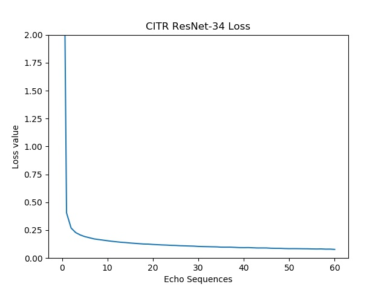

# T-Resnet: 10-Classes-Transportation-Resnet-Pytorch
## Written by Haolin Zhang and Dongfang Yang
## T_ResNet for OSU-CITR Pedestrian Detection Project 
## Latest Version:2019/11/19

Here is the PDF report [LINK](https://github.com/OSU-Haolin/T_Resnet-10-Classes-Transportation-Resnet-Pytorch/blob/master/Final%20Report%20of%20Individual%20Study_Haolin%20Zhang.pdf)  

### Environment

 pytorch 1.2 
 pytorch-gpu 1.2 
 opencv 3+ 
 torchnet 
 numpy 
 python2.7+ 
 torchvision 
 visdom 
 matplotlib 
 scikit-learn 

- install torchnet in conda :https://blog.csdn.net/weixin_43264516/article/details/83187775 
- please rebuild it in python2.7!

ResNet Pretrained Model Download:
	ResNet34----BasicBlock    /    ResNet101----Bottleneck----shortcut connection

### Run in (just for reference)

 Intel i7-6700K 
 NVIDIA 2070 Super 

### Tools

Please see the folder: Tools 

`checkimage.py` -----> Checking if all the images are in 'RGB'. 
`txtdata.py`  -------> Writing the class number with image names into TXT file. 

**Update(2019/11/19): We have added following two new tools for your convenience.**

`movedata.py`  ------> Randomly change the part(according to fixed rate) of the whole dataset to Val or Test dataset. 
`Revisename.py` -----> Revising the imge names with specific format in a folder. 

Please copy these .py files into the apropriate folder and run in python2.7.
 

### Notes

`dataset.py` 62line --->   if using JPG RGB ---->  data = Image.open(img_path).convert('RGB') 
if cannot load the keyvalue -----> Reading -----> https://blog.csdn.net/yangwangnndd/article/details/100207686 

### Goal

Train our own transporation dataset in ResNet to obtain specific transportation objects classification model. 
The model is for further combining with LiDAR Bounding Boxes Tracking.

### Dataset 

Partially obtained from 
- From Caltech 101 (http://www.vision.caltech.edu/Image_Datasets/Caltech101/)
- From Caltech 256  (http://www.vision.caltech.edu/Image_Datasets/Caltech256/)
- From Cars Dataset (https://ai.stanford.edu/~jkrause/cars/car_dataset.html)
- From INRIA Person Dataset (http://pascal.inrialpes.fr/data/human/)

mainly obtained from
- From PEdesTrian Attribute (PETA) Dataset (http://mmlab.ie.cuhk.edu.hk/projects/PETA.html)
//// Deng, Yubin, et al. Pedestrian attribute recognition at far distance. Proceedings of the 22nd ACM international conference on Multimedia. ACM, 2014. ////

**Update(2019/10/28): We have added a new dataset for our models.**

- From MIO-TCD dataset (http://podoce.dinf.usherbrooke.ca/challenge/dataset/)
//// Z. Luo, F.B.Charron, C.Lemaire, J.Konrad, S.Li, A.Mishra, A. Achkar, J. Eichel, P-M Jodoin MIO-TCD: A new benchmark dataset for vehicle classification and localization in press at IEEE Transactions on Image Processing, 2018 ////

`Train data`（70% of the whole data set, about 320000 images)
`Validation data` (15% of the whole data set, about 70000 images)
`Test data` （15% of the whole data set, about 70000 images)

### Object Classes

 0---pedestrian 
 1---car 
 2---bus 
 3---non-motorized vehicle 
 4---motorcycle 
 5---bicycle 
 6---truck 
 7---work van 
 8---animal 
 9---background 

### Using Steps

Pytorch_ResNet34 (or ResNet101)

- dataset：
  - train：`./data/`
  - model：`./models/` (https://cloud.tsinghua.edu.cn/d/dbf0243babd443c49e21/)
- train：
  - use`nohup python -m visdom.server &`open`Visdom`net
    or  #important!#  'python -m visdom.server'
    (optional!)
    
  - **Update(2019/11/19) the loss and acc visual images will be plotted after every echo!**
  
  - run`classifier_train.py`
  - save`.pth` in `./models/`
  - note：modify the parameters in `batch_size`
    - ResNet34，1GPU，`batch_size=120`，<7G  Recommend:60-100
    - ResNet101，1GPU，`batch_size=60`，<10G Recommend:unkown

- test step：
  - revise `classifier_test.py`，`ckpt`---path of trained model，`testdata_dir`----path of test images
    note:`ckpt`should be paired with `model`
  - run `classifier_test.py` get results 
  
**Update(2019/11/19): the test results can be visual by following two functions in `Tester.py`.**
    
   `test_cm()`-----> plot the image of confusion matrix 
   `test_line()`---> plot the lines of the probability of results

### Test code

1. test parameters
2. models ResNet34 or ResNet101
3. tester  using Tester
   `_load_ckpt()`   model load
   `test()` project one image

### Result

- Loss 

- Accuracy 

- Experimental result (Confusion Matrix) 

0---pedestrian / 1---car / 2---bus / 3---non-motorized vehicle / 4---motorcycle /  
5---bicycle / 6---truck / 7---work van / 8---animal / 9---background /  

### Reference

- [pytorch](https://github.com/pytorch/pytorch)
- [pytorch-book](https://github.com/chenyuntc/pytorch-book)
- He, Kaiming, Xiangyu Zhang, Shaoqing Ren, and Jian Sun. "Deep residual learning for image recognition." In Proceedings of the IEEE conference on computer vision and pattern recognition, pp. 770-778. 2016.
